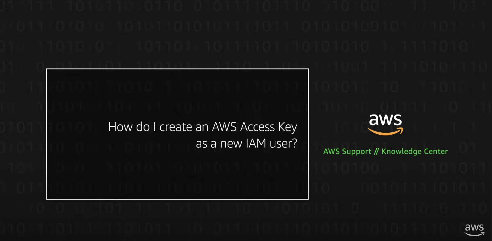

# Terraform Beginners Track - Amazon Web Services

## Prerequisites

- Recommended Code Editors:
  - [Visual Studio Code](https://code.visualstudio.com/download)
  - [Atom](https://atom.io/ )

- Hashicorp Terraform installed.

<a href="https://learn.hashicorp.com/tutorials/terraform/install-cli?in=terraform%2Faws-get-started&amp;wvideo=r3yytnk1pr">Install Terraform | Terraform - HashiCorp Learn</a>

- AWS Requirements
  - AWS Subscription.
  - Create AWS Access Key and Access Secret credentials

    
